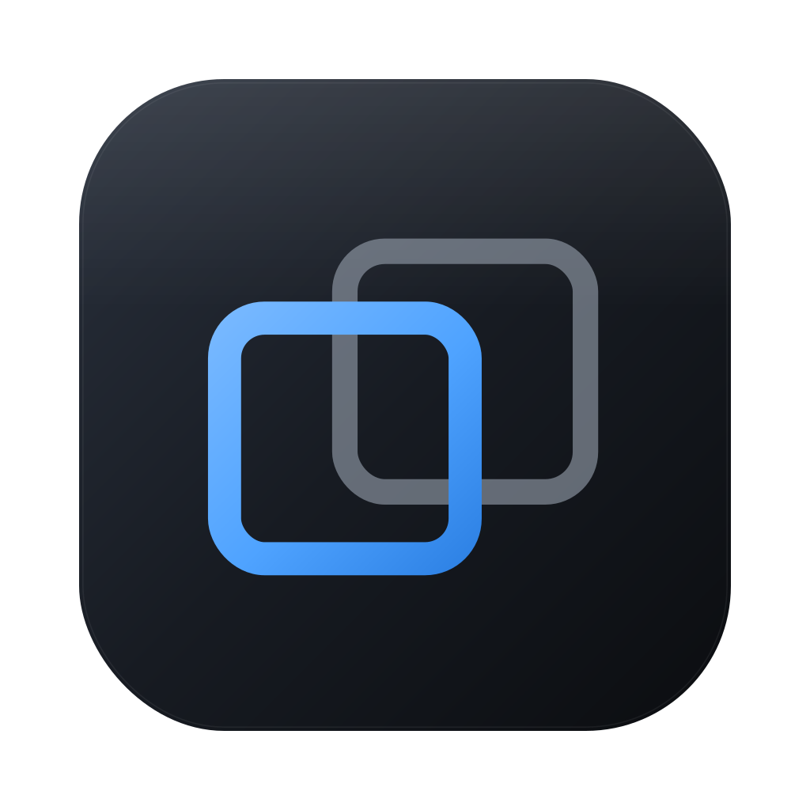
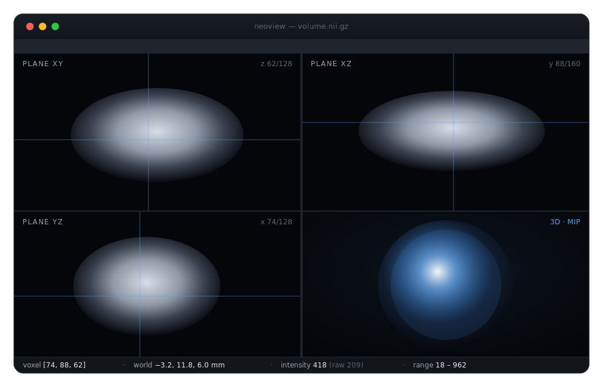

<div align="center">



# Neoview

**See inside volumetric data.**

A cross-platform desktop viewer for `.nii` / `.nii.gz` volumes — tri-planar slicing,
GPU raycast rendering, and interactive region segmentation, in one quiet, fast window.

[](https://www.electronjs.org/)
[](https://react.dev/)
[](https://www.typescriptlang.org/)


[**Website**](https://lijiaxiang63.github.io/neoview/) · [Features](#features) · [Getting started](#getting-started) · [Under the hood](#under-the-hood)

</div>

<p align="center">
  
</p>

---

## Features

### 🧭 Navigate
- **Three synchronized slice views** — planes XY, XZ, and YZ with linked crosshairs; click or drag in any view to move the crosshair, and the other two follow live
- **Wheel scrubbing** — scroll over a view to step through slices along its axis
- **Cursor readout** — voxel indices, world coordinates (via the affine), and raw / scaled intensity in the status bar
- **Maximize a view** — double-click any pane to fill the window; the others stay warm behind it
- **Folder browsing** — open a whole folder (`Cmd/Ctrl+Shift+O`, or drop one on the window) and every volume inside appears in a file panel, grouped by subfolder; large folders stream in while you work
- **`↑` / `↓` file switching** — step through the list from the keyboard; holding a key scrubs straight to the file you want, and the likely next file is prefetched so switching stays instant

### 🧊 Render in 3D
- **GPU volume rendering** — a WebGL2 raycaster in the fourth cell, with MIP and composite modes
- **Orbit / dolly camera** — drag to rotate, wheel to zoom, double-click to reset; brightness & density controls
- **Big-volume aware** — oversized volumes stride-downsample to a texture budget while slice views stay full resolution

### 🎚️ Tune & compare
- **Display range controls** — dual-thumb slider with Auto (2–98 percentile), Full range, and fixed presets; an apt preset is chosen automatically on load
- **Overlay layers** — drop additional volumes onto a loaded base to stack value maps (warm / cool / diverging colormaps with a threshold window), binary masks, and label volumes (distinct color per id); layers align through their affines with nearest-neighbor sampling, so differing grids work — each with its own visibility, opacity, and kind
- **4D support** — a frame slider appears for volumes carrying a fourth dimension

### ✂️ Segment regions
- **Box-driven segmentation** — draw a box on any slice; one hysteresis + 3D connected-component engine backs both threshold and grow methods, previewing live as you tune
- **Auto-threshold** via a plateau-aware Otsu, **6- or 26-connectivity**, minimum-size pruning, and a safety cap on whole-volume floods
- **Editable & re-editable** regions — right-click to reopen; export remaps to a clean label volume

### 📐 Inspect
- **Affine panel** — the full 4×4 voxel-to-world matrix, dimensions, spacing, datatype, and which transform source the file provided (matrix rows / quaternion / spacing fallback)
- **Drag & drop** — drop a `.nii` / `.nii.gz` file (or a whole folder) anywhere on the window, or open with `Cmd/Ctrl+O`

## Under the hood

No parsing, math, or rendering libraries — the whole pipeline is hand-written and unit-tested, and every byte of heavy work happens off the main thread.

| | |
|---|---|
| **From-scratch parser** | Both endiannesses, all common voxel datatypes, value scaling, quaternion & matrix affines, and a zero-copy typed-array view when the layout allows |
| **Streaming decompression** | Compressed files decompress through a streaming path that preallocates from the gzip size trailer, falling back to chunk accumulation when the trailer lies |
| **A worker per file** | Decompress, parse, stats, and texture packing run in a worker and transfer back as Transferables — the main thread pays only the GPU upload |
| **Exact statistics** | Small integer types get an exact 65,536-bin counting pass; floats use a min/max pass plus a histogram |
| **Fused texture build** | Sampling, scaling, `[0,1]` normalization, and half-float packing fuse into one loop, so slider drags stay pure uniform changes |
| **Resilient rendering** | Dirty-flag rAF (never a continuous loop); the raycaster rebuilds itself from cached data if the GL context is lost and restored |

## Getting started

Requires Node.js 22.12 or newer.

```bash
npm install
npm run dev           # start with hot reload
npm test              # parser / affine / extraction unit tests
npm run gen:testdata  # generate synthetic volumes under testdata/
```

The generator writes small synthetic volumes with closed-form voxel values (`testdata/*.nii`, `testdata/*.nii.gz`) so every feature can be verified without external data.

## Packaging

```bash
npm run build:mac    # dmg
npm run build:win    # nsis installer
npm run build:linux  # AppImage + deb
```

## Project layout

electron-vite three-process layout:

- **`src/main`** — window, menu, open-dialog IPC, large-file guard
- **`src/preload`** — contextBridge exposing `window.neoview`
- **`src/renderer`** — React 19 + zustand; parsing, slicing, overlays, segmentation, and the 3D raycaster

Runtime dependencies are intentionally minimal — no parsing, math, or rendering libraries.
